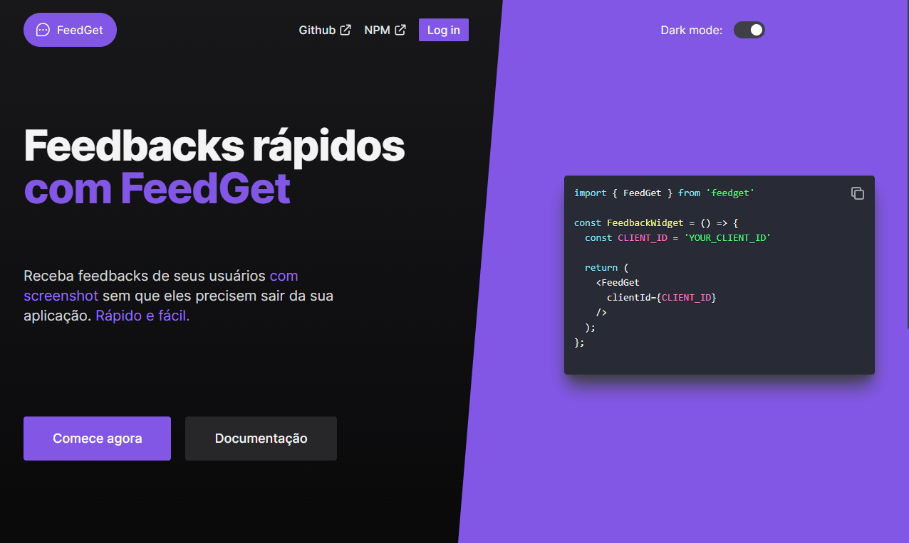

<h1 align="center">
  FeedGet - ReactJS
</h1>

  <a href="#-projeto">Projeto</a>&nbsp;&nbsp;&nbsp;|&nbsp;&nbsp;&nbsp;
  <a href="#-tecnologias">Tecnologias</a>&nbsp;&nbsp;&nbsp;|&nbsp;&nbsp;&nbsp;
  <a href="#-funcionalidades">Funcionalidades</a>

 

  

## 💻 Projeto

Este é o frontend do componente <a href="https://feedget.online" target="_blank">FeedGet</a>, um dashboard web feito com ReactJS e Typescript, estilizado com o TailwindCSS. Possui uma landing page com a documentação do componente e um dashboard que, integrado à <a href="https://github.com/Marceometry/feedget" target="_blank">API em Node</a>, exibe os feedbacks do usuário, assim como o `CLIENT_ID` necessário para a utilização do componente. Para acessar o dashboard, é preciso fazer login com o Github.

## 🧪 Tecnologias

Esse projeto foi desenvolvido com as seguintes tecnologias:

- [ReactJS](https://pt-br.reactjs.org/)
- [TypeScript](https://www.typescriptlang.org/)
- [TailwindCSS](https://tailwindcss.com/)

## 💣 Funcionalidades

- Documentação do componente `FeedGet`
- Integração com o OAuth do Github para realizar o login
- Integração com a api em node para listagem de feedbacks da aplicação

Repositório da lib FeedGet: <a href="https://github.com/Marceometry/feedget" target="_blank">https://github.com/Marceometry/feedget</a>

Repositório do backend Node: <a href="https://github.com/Marceometry/NLW-FeedGet-NodeJS" target="_blank">https://github.com/Marceometry/NLW-FeedGet-NodeJS</a>

---

<h4 align="center"> Feito com ♥ por Marcelino Teixeira </h4>
